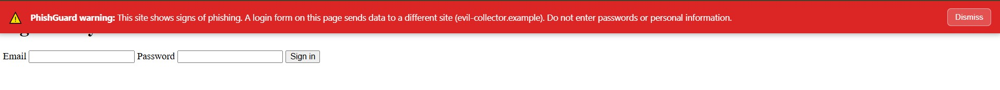
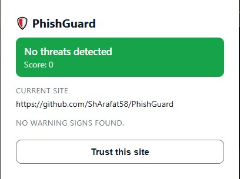
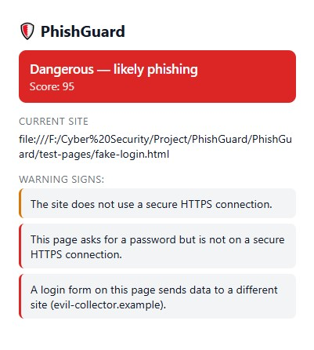
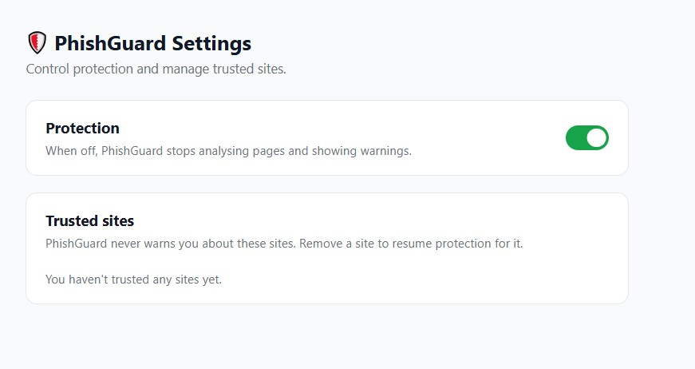

# 🛡️ PhishGuard


**A real-time phishing detection browser extension built with TypeScript and Manifest V3.**

PhishGuard analyses every page you visit and warns you when a site shows
signs of phishing — combining URL heuristics, live page (DOM) analysis, and
a reputation blocklist, all running locally in your browser.

---



## What is PhishGuard?

Phishing sites trick people into entering passwords and personal data on
pages that look legitimate. PhishGuard adds a layer of defence directly in
the browser: it inspects each page as it loads and, if it looks dangerous,
shows a clear warning — on the page itself, on the toolbar icon, and in a
detailed popup. All analysis happens **locally**; your browsing is never
sent to any server.

## Key Features

- **Real-time detection** — every page is analysed the moment it loads.
- **Three-layer warnings** — a colour-coded toolbar badge, a detailed
  popup verdict, and an on-page banner for dangerous sites.
- **URL heuristics** — detects IP-address hosts, `@` tricks, excessive
  length, too many subdomains, suspicious TLDs, punycode, and more.
- **Live page analysis** — flags password fields on insecure pages and
  login forms that submit data to a different domain.
- **Reputation blocklist** — matches known-phishing hosts offline.
- **User control** — a whitelist to trust specific sites, plus a master
  on/off switch, all saved across sessions.
- **Privacy-first** — no external calls, no tracking, minimal permissions
  (`activeTab` + `storage` only).

## Screenshots

**Safe site — no threats detected**



**Dangerous site — verdict with explained warning signs**



**Settings — protection toggle and trusted-site management**



## How It Works

PhishGuard has three components that communicate through type-safe messages:

- **Content script** (runs on each page) — reads the DOM and reports
  primitive facts (does it have a password field? where do forms submit?).
- **Background service worker** (the "brain") — applies user settings,
  runs the detection engine, stores per-tab results, updates the badge,
  and triggers warnings.
- **Popup & Options pages** — the user-facing interfaces.

The detection engine is a **pure, framework-free module**: each rule takes
input and returns a `RiskSignal | null`. A scorer sums the signals into a
`SAFE` / `SUSPICIOUS` / `DANGEROUS` verdict. Because the engine is pure, it
is fully unit-tested without a browser.

## Tech Stack

- **TypeScript** — type-safe, self-documenting code
- **Vite** + **@crxjs/vite-plugin** — fast builds and HMR for extensions
- **Manifest V3** — the current Chrome extension standard
- **Vitest** — unit and integration testing (51 tests)
- **ESLint** + **Prettier** — code quality and consistent formatting

## Detection Signals

| Category | Signals |
|----------|---------|
| URL | No HTTPS, IP-address host, `@` in URL, excessive length, many subdomains, suspicious TLD, punycode host |
| Page (DOM) | Password field without HTTPS, form action mismatch, insecure form action |
| Reputation | Host on offline phishing blocklist |

Each signal has a severity and score; a blocklist match alone is enough to
mark a page dangerous.

## Installation & Development

```bash
# Clone the repository
git clone https://github.com/ShArafat58/PhishGuard.git
cd PhishGuard

# Install dependencies
npm install

# Start the dev server (with hot reload)
npm run dev
```

Then load the extension in Chrome:

1. Open `chrome://extensions`
2. Enable **Developer mode** (top right)
3. Click **Load unpacked** and select the `dist` folder

```bash
# Build for production
npm run build
```

## Testing

```bash
npm test          # run all tests (watch mode)
npx vitest run    # run all tests once
npm run lint      # check code quality
```

The project has **51 automated tests** covering URL heuristics, DOM rules,
the blocklist, settings/whitelist logic (with a mocked Chrome API), and
edge cases (malformed input, boundary conditions).

## Security & Privacy

PhishGuard is a security tool, so it is designed to be secure itself. All
page-derived text is rendered with `textContent` (never `innerHTML`), the
warning banner is isolated in a closed Shadow DOM, incoming messages are
validated, and inputs are sanitised at runtime. See
[docs/SECURITY.md](docs/SECURITY.md) for the full threat model.

**Privacy:** blocklist matching is performed entirely offline against a
bundled list. Your browsing URLs never leave your machine.

## Limitations

PhishGuard is one layer of defence, not a guarantee:

- Heuristics can produce false positives and false negatives.
- The bundled blocklist is a small starter list for demonstration; a
  production deployment would sync a live threat feed.
- Feature collection is a one-time snapshot on page load, so content added
  later by JavaScript (e.g. in single-page apps) may be missed.

## Roadmap

- [ ] Sync a live threat feed (OpenPhish / PhishTank)
- [ ] Firefox port
- [ ] CI/CD with GitHub Actions
- [ ] `MutationObserver` for single-page-app navigation


## Installation (for users — no build needed)

1. Download the latest `phishguard.zip` from the [Releases page](https://github.com/ShArafat58/PhishGuard/releases).
2. Unzip it to a folder.
3. Open `chrome://extensions`, turn on **Developer mode** (top-right).
4. Click **Load unpacked** and select the unzipped folder.
5. PhishGuard is now active — browse normally and it will warn you about suspicious sites.

Released under the [MIT License](LICENSE).

---

*Built as a hands-on cybersecurity engineering project.*
